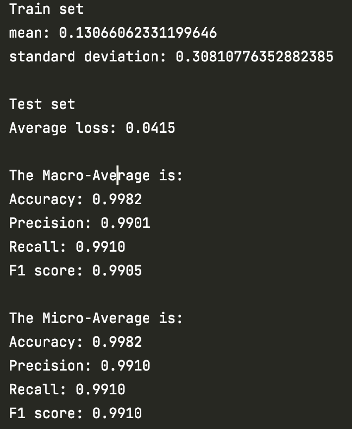
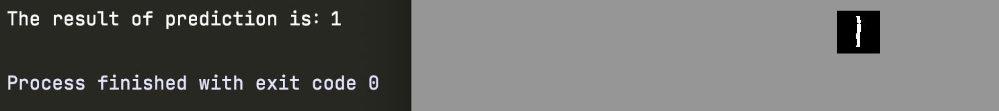

# README

## 问题分析

### 背景

在当今时代，机器智能已经广泛地应用于人类生活的许多场景，其中字符识别的应用最为广泛。在各行各业中，字符识别程序能够很好的帮助人们提取外界的字符信息，这提高了人们的工作效率。现在各种类别下的字符识别已经有了不错的发展。

本次实验主要研究基于BP算法的手写数字识别的实现。

### 分析

手写数字识别，即实现计算机程序能够识别输入图片中的手写数字，并转换为实际的数值存储于计算机设备中。广义来说，我们希望计算机能识别图片中的有效数字信息（不仅仅是手写体，也包括印刷体）。简单的BP神经网络可以很好的实现这个识别过程。

### 技术路线

#### 使用BP算法

1. 原理：在网络层中，信号从输入层进入网络，正向传播至输出层；在实际训练中，实际的输出值若与期望值不等，则计算误差，并将误差反向传播至隐藏层各层，具体实现方式：利用梯度下降法修改隐藏层中的参数，使误差信号造成的影响减小到最小。
2. 思想：在庞大样本数量下，利用BP算法可以使神经网络隐藏层中的参数不断优化，进而使输入的数据更能符合所预期的输出结果，达到“机器学习”的目的。

#### 选用LeNet模型

LeNet是由LeCun在1989年提出的历史上第1个真正意义上的卷积神经网络模型。不过最初的LeNet模型已经不再被人们使用了,被使用最多的是在1998年出现的LeNet的改进版本LeNet-5. LeNet-5作为卷积神经网络模型的先驱,最先被用于处理计算机视觉问题,在识别手写字体的准确性上取得了非常好的成绩。


上图为LeNet5的神经网络架构，由1个输出层、3个卷积层、2个池化层、1个全连接层和1个输出层构成。最后，讲输出层的10个值输入至softmax激活函数后得到10个数字所对应的概率值，概率值最大的则被选作预测的数字。

#### 手写预测程序

除了识别程序，本人还实现了python的手写画板，能够为识别程序额外提供手写测试样例。

#### 数据集

使用网络上公开的Mnist数据集，包含60000个训练样例和10000个测试样例

#### 实验环境

Python 3.8

Pytorch 1.10.2

## 算法设计

### 公开库的调用

```python
import torch
import torch.nn as nn
import torch.nn.functional as F
import torch.utils.data as tData
import torch.optim as optim
from torchvision import datasets, transforms
from torchvision.transforms import ToPILImage
import numpy as np
import os
from PIL import Image
```

### 数据初始化

```python
def init_dataloader()
```

在数据初始化模块中，需要将mnist数据集载入torchvision中的dataloader类里。在导入数据之前，先使用numpy计算mnist数据集的均值和方差：

```python
mnist = datasets.MNIST('./data/', train=True, download=True,                        			 transform=transforms.Compose([transforms.ToTensor(), ]))
data = [d[0].data.cpu().numpy() for d in mnist]
mean, std = np.mean(data), np.std(data)
```

mnist数据集的导入只需要调用MNIST类，并将download属性设置为True即可完成自动下载，train属性设置为True则表示导入的是训练集合（60000个样本）。

接下来，将训练集合和测试集合一一导入dataloader类里：

```python
train_loader = tData.DataLoader(
datasets.MNIST('./data/', train=True, download=False,
                       transform=transforms.Compose([  # 将多个图片变换方式结合在一起
                           transforms.ToTensor(),
                           transforms.RandomCrop(size=(32, 32), padding=2),
                           transforms.Normalize((mean,), (std,))])
                       ),
        batch_size=50, shuffle=True)

test_loader = tData.DataLoader(
        datasets.MNIST('./data/', train=False, download=False,
                       transform=transforms.Compose([
                           transforms.ToTensor(),
                           transforms.RandomCrop(size=(32, 32), padding=2),
                           transforms.Normalize((mean,), (std,))])
                       ),
        batch_size=1000, shuffle=True)
```

除了上文中已经提及的属性，还有transform、batch_size和shuffle属性。transforms.Compose()是将多种图片变换方式结合在一起。

1. transforms.ToTensor()：将图片转换为pytorch张量的形式存储。
2. transforms.RandomCrop(size=(32, 32), padding=2)：将输入的图片进行重新裁剪，由于mnist数据集的输入图像为 28pixel*28pixel，而Lenet5的输入层需要达到32\*32，所以需要填充两层的padding。
3. transforms.Normalize((mean,), (std,)：将数据集使用均值方差进行变换，使数据集更容易收敛。

batch_size的值决定dataloader一次释放的样本数量（批处理），shuffle为True则表示每次dataloader批量释放样本后重新冲洗数据（相当于洗牌）。

### 神经网络定义

```python
class LeNet5(nn.Module):
    def __init__(self):
        super(LeNet5, self).__init__()
        self.layer1 = nn.Sequential(
            nn.Conv2d(1, 6, kernel_size=5),
            nn.ReLU(),
            nn.MaxPool2d(kernel_size=2, stride=2)
        )
        self.layer2 = nn.Sequential(
            nn.Conv2d(6, 16, kernel_size=5),
            nn.ReLU(),
            nn.MaxPool2d(kernel_size=2, stride=2)
        )
        self.layer3 = nn.Sequential(
            nn.Conv2d(16, 120, kernel_size=5),
            nn.ReLU(),
        )
        self.fc1 = nn.Linear(120, 84)
        self.fc2 = nn.Linear(84, 10)

    def forward(self, x):
        out = self.layer1(x)
        out = self.layer2(out)
        out = self.layer3(out)
        out = out.reshape(out.size(0), -1)
        out = self.fc1(out)
        out = self.fc2(out)
        out = F.log_softmax(out, dim=1)
        return out
```

在神经网络的定义中，\_\_init\_\_用于初始化网络各层；其中ReLU为线性激活单元，每次卷积后必须要调用该函数进行激活。在forward函数中，将输入与神经网络层相连接，模拟信号前向传播的进程，最终输入log_softmax函数获得输出。

### 开始训练模型

```python
def train(epoch, network, optimizer, train_loader):
    network.train()  # 使神经网络处于训练模式
    for batch_idx, (data, target) in enumerate(train_loader):
        optimizer.zero_grad()  # 手动将梯度设置为0
        output = network(data)  # 前向传递信号
        loss = F.nll_loss(output, target)  # 计算loss值（也可以用CrossEntropyLoss一步到位）
        loss.backward()  # 误差的后向传播
        optimizer.step()  # 将过程步骤记录至优化器中
        if batch_idx % 10 == 0:
            print('Train Epoch: {} [{}/{} ({:.0f}%)]\tLoss: {:.6f}'.format(
                epoch, batch_idx * len(data), len(train_loader.dataset),
                       100. * batch_idx / len(train_loader), loss.item()))
            torch.save(network.state_dict(), 'pth/model.pth')
            torch.save(optimizer.state_dict(), 'pth/optimizer.pth')
```

训练函数较为简单：获得神经网络对象，开始训练，批量处理样本、前向传递，计算损失后后向传播，并且保证每训练完一次样本都会将模型和优化器保存至当前目录下的pth文件夹中，以便于后续训练能衔接之前训练的模型。

### 测试样本

```python
def test(model, test_loader):
    model.eval()
    test_loss = 0

    with torch.no_grad():  # 不会跟踪梯度
        for data, target in test_loader:
            output = model(data)
            test_loss += F.nll_loss(output, target, reduction='sum').item()  # 记录loss值
            pred = output.data.max(1, keepdim=True)[1]
    test_loss /= len(test_loader.dataset)
    print('\nTest set\nAverage loss: {:.4f}\n'.format(test_loss))

    pred = pred.squeeze(1)
    statistics.macro_Avg(target, pred)
    statistics.micro_Avg(target, pred)
```

在测试样本函数中，由于之前已经将测试样本泛化，因此需要先调用.eval()将权值固定；在样本的批量测试中，设置了累加loss值的变量，并在测试完成后输出显示了整个test样本的loss值。最后，计算宏平均和微平均的各指标。

### 计算指标

```python
def digital_num(data):
    cal_dict = {}
    for i in range(0, 10):
        cal_dict[i] = 0
    for batch_idx, (data, target) in enumerate(data):
        for x in target:
            cal_dict[x.item()] = cal_dict[x.item()]+1
    print(cal_dict)
```

该函数为统计dataloader中10个数字各自的个数；

```python
def get_basic_indicator(target, pred):
    res = {'TP':{}, 'FP': {}, 'TN': {}, 'FN': {}}

    for k in res.keys():
        for i in range(0, 10):
            res[k][i] = 0  # 初始化各项基本指标

    if target.size() == pred.size():
        for i in range(0, target.shape[0]):
            t = target[i].item()
            p = pred[i].item()
            if t == p:
                res['TP'][t] = res['TP'][t] + 1  # 被正确分类
                for j in range(0, 10):
                    if j != t:
                        res['TN'][j] = res['TN'][j] + 1
                        # 对任何其它类别来说是正确被分入负类
            else:
                res['FN'][t] = res['FN'][t] + 1  # 被误分类为负样本
                res['FP'][p] = res['FP'][p] + 1

    return res
```

该函数为统计某个数字的基本指标：

1. 标签为正样本，分类为正样本的数目为True Positive，简称TP；
2. 标签为正样本，分类为负样本的数目为False Negative，简称FN；
3. 标签为负样本，分类为正样本的数目为False Positive，简称FP；
4. 标签为负样本，分类为负样本的数目为True Negative，简称TN。

将基本指标的概念拓展到多分类后，可以认为某个数字的正类是它本身，负类则是除了它本身以外的所有数字类别。因此：

1. 当数字a被正确预测时，它的TP值将+1，同时对于任何其它类别的数字b（b in {0-9} and b neq a)，它们的TN值应该+1，因为对于其它数字而言负类被正确的分入负类了。
2. 当数字a没有被正确预测时，它的FN值将+1，被误分类的数字b的TN值将+1。

在统计完成后，会返回一个字典类型变量，里面保存了所有数字的基本指标值。

```python
def micro_Avg(target, pred)
def macro_Avg(target, pred)
```

在计算完成基本指标值后，将计算宏平均和微平均。

1. 宏平均(Macro-Average)：先计算各个小类的指标，再计算平均值。
2. 微平均(Micro-Average)：先计算TP, FP, TN, FN的平均值，再计算指标。
3. 所计算的指标包括：准确率，精确率，召回率以及F1分数

$$
Accuracy=\frac{TP+TN}{TP+TN+FP+FN}\\
Precision(P)=\frac{TP}{TP+FP}\\
Recall(R)=\frac{TP}{TP+FN}\\
F_1=\frac{2*P*R}{P+R}
$$

在经历了20轮的样本训练后，所得到的输出如下：



### 自定义样本的测试

除了对训练样本的测试，本人在程序中还编写了使用自定图片源进行数字识别。

```python
def predict_image(path, model):
    img = Image.open(path)
    # img.show()
    show = ToPILImage()  # 可以把Tensor转成Image，方便可视化
    transform = transforms.Compose([transforms.Grayscale(num_output_channels=1), # 将图片灰白化
                                    transforms.ToTensor(),
                                    transforms.ColorJitter(contrast=100),]) # 提高图片的对比度
    trans1 = nn.ReplicationPad2d(2)
    trans2 = transforms.Resize((28, 28))

    tensor = reinforcement(transform(img))
    tensor = trans1(trans2(tensor))
    tensor = vampix(reinforcement(tensor))
    show(tensor).show() # 将图片修正为32*32样式，并将图片中所有像素点修正为0、1值，以及将所有笔迹的值设为1（全白），背景设为0（全黑）

    temp = tensor.data.cpu().numpy()
    m, s = np.mean(temp), np.std(temp)
    tensor = (tensor - m) / s # 泛化图片

    tensor = tensor.unsqueeze(dim=0) # 扩展图片维度，开始预测
    pred = model(tensor).data.max(1, keepdim=True)[1]
    print("The result of prediction is：{}".format(pred[0][0]))
```

随便对一张图片进行预测：



## 碰到的问题

#### 一、mnist数据集中样本图片的尺寸与Lenet5中输入层所需的尺寸大小不同

#### 二、如何从上次训练中生成的模型恢复，进行再次训练或测试

#### 三、想使用自定义数据集进行识别预测，图片的尺寸和样式与mnist数据集中的样本不符合

## 解决方案

#### 一、使用RandomCrop进行padding填充

#### 二、使用.load_state_dict()进行pth文件的载入；

#### 三、解决方案如下：

首先，将图片进行灰白化+提高对比度，这样做的目的是为了使字迹更清晰；再将图片（现在已经存储于pytorch张量形式）进行01化，具体实现方式：

```python
def reinforcement(tensor):
    h = tensor.size()[1]
    w = tensor.size()[2]

    for i in range(0, h):
        for j in range(0, w):
            if tensor[0][i][j] == tensor[0][0][0]:
                tensor[0][i][j] = 1.0
            if tensor[0][i][j] <= 0.999 and tensor[0][i][j] >= 0.0:
                tensor[0][i][j] = 0.0
            if tensor[0][i][j] <= 1.0 and tensor[0][i][j] > 0.999:
                tensor[0][i][j] = 1.0

    return tensor
```

第二步，将图片进行黑白反转，因为在网上搜索了相关资料后发现mnist数据集中所有图片都是黑底白字：

```python
def vampix(tensor):
    h = tensor.size()[1]
    w = tensor.size()[2]

    for i in range(0, h):
        for j in range(0, w):
            if tensor[0][i][j] == 0.0:
                tensor[0][i][j] = 1.0
            else:
                tensor[0][i][j] = 0.0

    return tensor
```

第三步，将图片缩小至28*28，再使用padding=2进行填充。不直接缩小至32\*32的原因是：训练集合是源于mnist数据集的28\*28样本图片，它们经过padding=2填充后，最外层两圈像素是在模型训练时不会考虑的部位。

第四步，计算输入样本均值和方差进行泛化。

第五步，扩展维度，这是因为在训练样本和测试样本都使用了mini-batch的方式，对样本进行批处理，而批处理的实质是将多个样本叠加起来，比单个样本增加了一个维度。

最后，将处理好的数据输入神经网络中，获得预测值。

## 结果分析与思考

在测试样本中，通过计算可以观察到每个数字的样本数量相差不是很大：


在宏平均和微平均下的各类指标，差值均在百分之一的水平内，相差程度不是很大。

但在使用自定义数据集测试时，也发现了问题：由于书写习惯，7有两种写法：

第一种写法：


第二种写法：


在实际预测时，第一种写法的7能够被准确的预测：


而第二种写法的7则被误识别为3:


我自己的理解而言，手写数字识别就像是图像识别领域的“hello world”，是一个入门实验。从数字7识别结果来看，在各种图像识别的问题上可能会遇到很多类似的问题，就是不同类别的特征有一定的相似度导致的误分类。我个人猜测产生这样的结果应该是“过拟合”所导致的问题。我想出的一种解决方案：将这两个书写方式下的7分成两个不同样的类，最后再通过简单的分类函数将它们统一归类到数字7类别下，这样在分类时就不用考虑过拟合的问题。